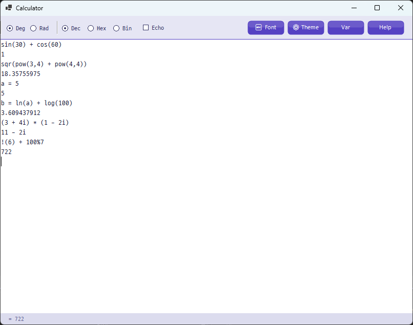

# 🧮 Calculator

A keyboard-driven expression calculator built with **C# .NET 8 WinForms**.  
Type an expression, press **Enter**, and get the result instantly — no buttons needed.


---

## Screenshots



---

## Features

- ✅ Basic arithmetic: `+`, `-`, `*`, `/`, `%`, `^`
- ✅ Math functions: `sin`, `cos`, `tan`, `ln`, `log`, `exp`, `sqr`, `pow`, and more
- ✅ Complex number support: `(3 + 4i) * (1 - 2i)`
- ✅ Variable assignment: `a = 10`, `bc = sqr(16)`
- ✅ Number base literals: `0xFF` (Hex), `0b10011` (Binary)
- ✅ Factorization: `fact 12` → `2 × 2 × 3`
- ✅ Deg / Rad mode toggle
- ✅ Dec / Hex / Bin output mode
- ✅ Multi-line paste — evaluates line by line in order
- ✅ Dark / Light / Monokai themes
- ✅ Customizable UI font and editor font
- ✅ Settings saved automatically (`%AppData%\Calculator\settings.json`)

---

## Download

Go to [Releases](../../releases) and download the latest `Calculator.exe`.  

**.NET 8 Runtime** is required.  
[Download .NET 8 Runtime](https://dotnet.microsoft.com/download/dotnet/8.0)

---

## Usage

| Key | Action |
|---|---|
| `Enter` | Evaluate current line |
| `F1` | Open help |
| `F12` | Evaluate current line (alternate) |
| `Insert` | Insert last result at cursor |
| `Ctrl+V` | Paste and evaluate line by line |

### Examples

```
sin(30) + cos(60)         → 1
pow(2, 10)                → 1024
a = 5
b = ln(a) + log(100)      → 3.609437912
(3 + 4i) * (1 - 2i)      → 11 - 2i
!(6) + 100%7              → 722
0xFF + 0b1010             → 265
fact 12                   → 2 × 2 × 3
```

### Supported Functions

| Function | Description |
|---|---|
| `sin(x)`, `cos(x)`, `tan(x)` | Trigonometric (Deg or Rad) |
| `asin(x)`, `acos(x)`, `atan(x)` | Inverse trigonometric |
| `sinh(x)`, `cosh(x)`, `tanh(x)` | Hyperbolic |
| `ln(x)`, `log(x)` | Natural log, log base 10 |
| `exp(x)` | e raised to the power of x |
| `pow(x, y)` | x raised to the power y |
| `sqr(x)` | Square root |
| `sqrn(x, y)` | y-th root of x |
| `abs(x)` | Absolute value |
| `int(x)` | Integer part |
| `rnd(x)` | Random value between 0 and x |
| `max(x, y)`, `min(x, y)` | Maximum / Minimum |
| `!(x)` | Factorial |
| `re(x)`, `im(x)`, `norm(x)` | Complex: real part, imaginary part, magnitude² |
| `pol(x, y)` | Complex from polar coordinates |

### Keywords

```
clr / cls          Clear the screen
precision 5        Set output decimal precision
fact 12            Prime factorization
# comment          Rest of line is ignored
```

---

## Build from Source

**Requirements:** .NET 8 SDK, Windows

```bash
git clone https://github.com/fill-light/Calculator.git
cd Calculator
dotnet build -c Release
```

**Publish as single EXE:**

```bash
dotnet publish -c Release
# Output: bin\Release\net8.0-windows\win-x64\publish\Calculator.exe
```

---

## Project Structure

```
Calculator/
├── Program.cs            Entry point
├── Calculator.csproj     Project file (.NET 8, WinForms)
├── CalculatorForm.cs     Main form — UI and calculation logic
├── ExpressionParser.cs   Recursive descent parser (real numbers)
├── ComplexParser.cs      Complex number expression parser
├── AppSettings.cs        JSON settings save/load
├── FontPickerForm.cs     Font picker dialog
├── ThemePickerForm.cs    Theme picker dialog
└── HelpForm.cs           Help window
```

---

## Contributing

Contributions are welcome! Feel free to open an [Issue](../../issues) or submit a [Pull Request](../../pulls).

1. Fork the repository
2. Create a feature branch: `git checkout -b feature/my-feature`
3. Commit your changes: `git commit -m "Add my feature"`
4. Push to the branch: `git push origin feature/my-feature`
5. Open a Pull Request

---

## License

This project is licensed under the [MIT License](LICENSE).
